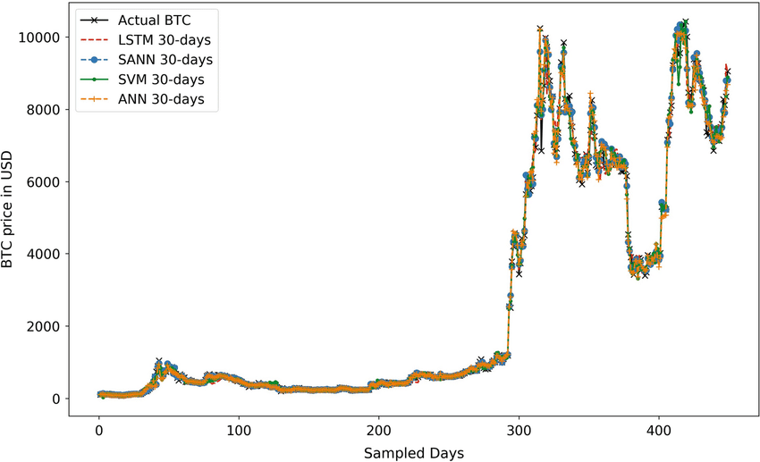
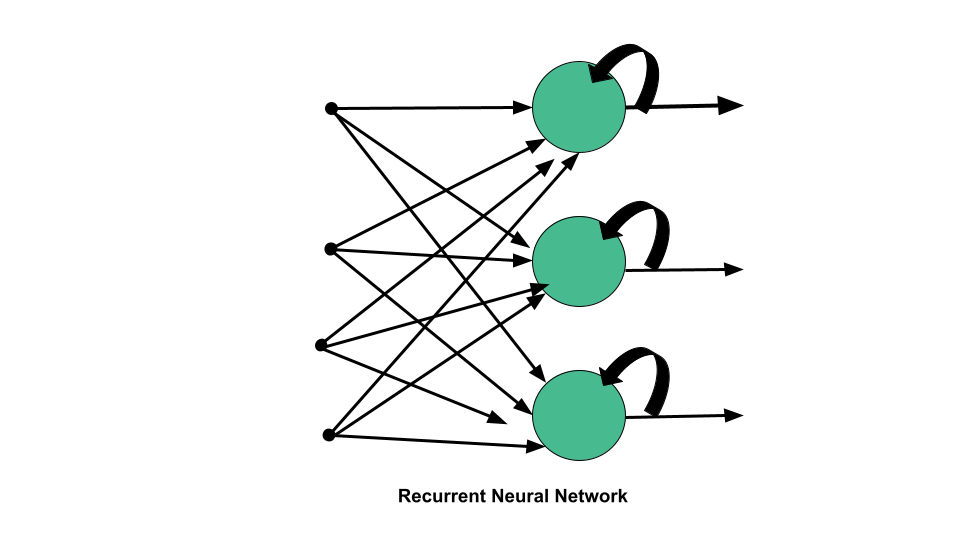
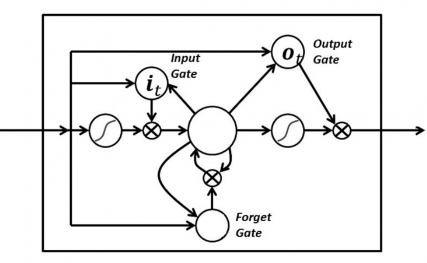

# **Crptocurrency Price Prediction Using Long-Short Term Memory**

---

**Made By**-
1. Yash Sethia *(2019UCS2036)*
2. Shubham *(2019UCS2058)*
3. Ashwani Tanwar*(2019UCS2034)* 
4. Ritesh Kumar *(2019UCS2035)*

> **Cryptocurrency** is a type of online payment that may be used to buy and sell products and services. Many businesses have created their own currencies, known as tokens, that can be exchanged for the goods or services that the business offers. Consider them to be arcade tokens or casino chips. To use the good or service, you'll need to convert actual money for cryptocurrency. is the technology that enables cryptocurrency to function. is a technology that handles and records transactions across numerous computers. The security of this technology is part of its attractiveness.

> Almost 15,000 different cryptocurrencies are publicly traded, and cryptocurrencies are continuing to spread into new markets. On December 3rd, 2021, the total value of all cryptocurrencies was around 2.6 trillion dollars, down from an all-time high of **\$2.9 trillion** just weeks before. The overall market value of bitcoins, the most widely used digital money, was estimated to be around $1.1 trillion.

> Ethereum is the second largest cryptocurrency after Bitcoin. With so much hype and frenzy about cryptocurrecies several investors wish to build their wealth using this new-age technology. Similar to the stock markets, cryptocurrenices fluctuate due to a large number of factors including internet, more adoption in mainstream use, government regulations, tweets, cybersecurity attacks on several networks, etc.** Timely prediction of values** using emerging techniques like *machine learning* has enabled several investors to take advantage of the liquidity in the market and cash in more money. The biggest advantage to the market is the presence of **high volatility** leaving room for a lot of speculation and hence, prediction. 

> We'll look at three of the most well-known ones in this study. As a result, the paper aims to do the following by employing machine learning algorithms that can uncover hidden patterns in data, integrate them, and generate considerably more accurate predictions: • Providing a complete examination of the many existing techniques for predicting the prices of Bitcoin, Ethereum, and (BTC, ETH, and LTC, respectively). • For prediction, a deep learning method called long short-term memory (LSTM) has been used.
The main goal is to develop a trustworthy prediction model based on historical values that investors can trust. The article also attempts to address the following research questions:
  * How can machine learning algorithms assist investors and decision-makers in predicting cryptocurrency prices?
  * 'What is the best model for predicting future cryptocurrency prices?

### **Problem Definition** 

Cryptocurrencies are a highly popular asset in the modern age of the internet and are set to take center stage with the advent of Web3.0 . More and more wish to acquire such crypto assets. There are a lot of cryptocurrencies in the market currently including Ethereum, Bitcoin, Litecoin, Dogecoin, Matic Network, etc which are traded over several crypto exchanges such as Binance, Wazir and Coinbase. 
One of the biggest issues with cryptocurrencies is volatility which makes it harder to track its prices. This makes it difficult for users to invest properly. They are not able to decide how many coins to buy and when. To solve this problem, we want to make a cryptocurrency price predictor which will predict the prices of 3 currencies - ETH, BTC, LTC. The model will then help us allocate different amounts of sum(buying and selling both) to different currencies depending on the amount entered by the user.

### **Possible Solution**

There are various ways to predict the prices. Some of the most popular techniques are:
1. **Regression**: It is one of the most significantly used predictive modelling techniques. Regression is used to fit a predictive model to an observed data set of values of the response and explanatory variables. Models like Logarithmic Regression are well suited as shown:

  

2. **Support Vector Machines (SVM)**: SVMs are very popular for classification problems. It deals with parameters like Kernel, Hyper plane and Decision Boundary.

3. **Recurrent Neural Networks (RNN) and Long Short-Term Memory (LSTM)**: RNNs are a robust and one of the most powerful type of neural network because they support internal memory. LSTMs enable RNNs to remember inputs over a long period of time.

The performance of these techniques can be seen in this diagram:

  

Using any of these techniques, we can train our model on cryptocurrency prices of past years and then from the learning of that model, we can test and predict the present and future values of these cryptocurrencies.

In this project, we will be using the prediction technique involving RNN and LSTM as it is the most powerful one.

### **Dataset used in this Project**

We are training our pricing model, using public price data of cryptocurrencies reported from Jan 1st, 2016 to Dec 31, 2020 downloaded from Yahoo Finance. For testing our model, we use the price data of cryptocurrencies from Jan 1st 2021 to present date. We use the model to predict the crytocurrency prices for this period and compare it to the actual prices to check the efficiency of this model in predicting the prices.

### **Model we have used for prediction**

We are using a multilayer RNN Long Term Short Term Memory (LSTM) model having 3 LSTM layers with each layer followed by a dropout layer (with 20% dropout frequency) and at last have used a Dense layer to produce the predicted price.

In RNN, the information goes through a cycle. When making a decision, it considers the current input and also what it has learned from the inputs it has received previously.

The image below illustrates how the flow of information works in the RNN algorithm:

In an LSTM there are three gates: 
1. Input Gate
2. Forget Gate
3. Output Gate

These gates determine whether or not to let new input in (input gate), delete the information because it isn’t important (forget gate), or let it impact the output at the current timestep (output gate). Below is an illustration of an RNN with its three gates:

The gates in an LSTM are analog in the form of sigmoids, so they also range from zero to one. This helps in backpropagation.

Thus we can train our data using this model and then predict the future prices of cryptocurrencies from the learnings of the model.

### **Problems with our approach**

The RNN-LSTM model that we have used to predict the prices of crypto currency is very accurate on the test data, however, it fails to predict the prices very accurately for the long term. We observed that the model can be used for predicting prices only for the next 5-7 days without significant loss in accuracy. That is why we have only used the model to predict the prices for the next 7 days.

### **Implementation**

The Implementation can be found in the model.ipynb file

